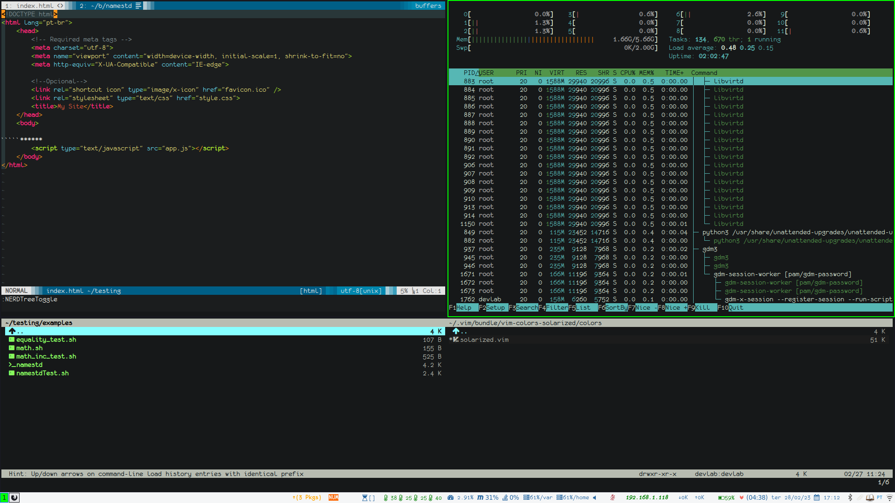

<h1 align="center">Dotfiles Repository 🐧</h1>

<p align="center">


</p>

<br>

_This code was provided by_ ;
- originally by user ___StreakyCobra___ in an [Hacker News thread](https://news.ycombinator.com/item?id=11070797)
- In a wonderful tutorial by ___[Nicola Paolucci](https://www.atlassian.com/git/tutorials/dotfiles)___
Thank you guys for sharing :heart:
- Tests by [Shunit2](https://github.com/kward/shunit2)
<br>

## Sumary

- [Requirements](https://github.com/brnfra/dotfiles#requirements)
- [Install](https://github.com/brnfra/dotfiles#how-to-install)
- [Pull state from remote after installation](https://github.com/brnfra/dotfiles#pull-state-from-remote-to-local-config)
- [Update my dotfiles after installation](https://github.com/brnfra/dotfiles#update-remote-state-from-local-to-remote)
- [Dependencies(check your pkgs)](https://github.com/brnfra/dotfiles#dependencies)

## Using git to manage config files.

### Main config

1. Tested in Gnu/Linux based distro(**Debian based**, pls check first).
2. Pls check ```~/.i3/autostart/i3config``` . There's change in keyboard layout and resolution.
3. The keyboard layout is **US-INT**.

</img>

### Mingw32(git-for-windows) config(mingw32-w8 branch)

1. Config files for Gnu/Linux based distro systems(git-bash.exe).
2. Remove scripts for programs for linux systems.
3. Remove .config/ folder and some configurations.
4. The keyboard layout is **PT-BR,ABNT**.

**ATTENTION**: Please, DO NOT copy/run any file here in your system **if you do not fully understand what it does**. Seriously, **DON'T do it!**
This configuration works with **i3-wm** and **i3status**.  

## TODO

- [ ] Create uninstall script to back original config
- [ ] Make scripts to generate configs(i3blocks, vim,  etc)
- [ ] Fix audio/mic control for Ubuntu in i3block config
- [ ] Testing and refactoring
- [x] Create file with params and defs
- [x] Make tests to check files already created/copy
- [x] Create test_config branch

<br>

## Requirements

- Git
- Ssh 
- Curl

## How to install
 
This method consist to use git to track your config files. **You don't have to install extra tool**, only need git, ssh(coreutils) and curl.
Install config tracking in your **$HOME** following the comand;

1. Fork this repository.

2. Edit ```/bin/install``` file to put your repository url, branch name, email and name.

3. Update your remote forked repository (push changes) and execute script bellow ( **check your username** ).


>If Desktop/Virtual/Notebooks, copy/paste in terminal;
```bash
bash -c "$(curl -s --max-time 15  https://raw.githubusercontent.com/[YOUR_USER_NAME]/dotfiles/main/bin/install)";
```

>If Desktop/Virtual/Notebooks, copy/paste in terminal(MY DEFAULT);
```bash
bash -c "$(curl -s --max-time 15  https://raw.githubusercontent.com/brnfra/dotfiles/main/bin/install)";
```

>If testing, copy/paste in terminal;
```bash
bash -c "$(curl -s --max-time 15  https://raw.githubusercontent.com/brnfra/dotfiles/testing/bin/install)";
```

>If Mingw for Windows, copy/paste in terminal;
```bash
 bash -c "$(curl -s --max-time 15  https://raw.githubusercontent.com/[YOUR_USER_NAME]/dotfiles/mingw32-w8/bin/install-mingw-cfg)"; bash ~/bin/install_enviroment
```

<br>

Check the script ```/bin/install_enviroment``` get username and email from ```/bin/install```. Configure your definitions **before** run it.
*Read and edit it first for your purpose*, it will create some folders and copy config files, you can fork this repo and coment that line.
Attention on ssh-key problems, just in case, check your email and user, you find help [here](https://docs.github.com/pt/authentication/connecting-to-github-with-ssh).
<br>

- [**Optional**] If you'll create enviroment to Java, Spring and React the script ___java_spring_react.sh___ gonna install *Heroku CLI*, *Postman*, *VSCode* and *Spring Tool Suite* in folder ```~/.local/opt/``` and add the **PATH** to **.bash_exports**.
In the ``` ~/bin```  folder there are scripts for each case.

## Update remote state from local to remote 

If I change configuration and like it, *How can I update for this change?*
- You can update your remote repository and, after tests, run the script below. 

1. Clone this repo in another local.(here the default is ```~/documents/projects/git/ ``` )
2. Change to the correspondent branch by ```git switch [main or mingw32-w8]``` 
3. Make the changes and push to remote repo in correspondent branch. 
4. In the computers run pull script and receive the updates.(wait a minute in the same computer to update HEAD)

Run ```$ push_local_config "COMMIT MESSAGE" ``` gonna make copy my edited config files to
**dotfiles** folder created in ```enviroment script``` and push to your remote repository[auto].

Run ```$ stage-local-config``` gonna only make copy, without push, the edited config files to
**dotfiles** folder. Now check the status and, if it's fine, next, proceed to push changes.

```
$ git push origin [main/mingw32-w8]
```
Now, Git gonna **update snapshot** from local to remote.

## Pull state from remote to local config

After install, if remote has changed you can pull config to sync local, *How can I sync local for this change?*
- You can pull to your local repository run the script below. 

In the folder ```~/bin``` there is a script named ```pull_config``` such make a "**pull request**" like a normal git repo. Just run;

```
$ pull_config

or

$ bash ~/bin/pull_config 
```

Now, Git gonna **update snapshot** from remote repo to your $HOME folder.


## Dependencies

Some pkgs here have conflicts with i3-gaps(i3-wm) and, after fork, **make changes to yours needs**, in files.

- i3blocks
- nm-applet(tool to show network icon)
- diodon(tool to show transfer area icon)
- gnome-screenshot(printscreen)
- compton(composer)
- nitrogen(wallpaper)
- fzf
- fdfind
- exa

Some functions require some aplications and packages like xorg,fzf,fdfind for example.
If you want full functions here will required, for some functions, the previous installation of some packages like;

- I3wm
- I3blocks 
- Compton
- Vim
- NeoVim
- Vifm
- Xfce4-terminal
- fzf

## Problems

If you get the error message 

```:fatal: destination path '/home/$USER/.dotfiles' already exists and is not an empty directory. ``` 

after install or trying update your local configs, try this;

1. Delete, in your home folder, ```~/.dotfiles/``` .

2. Re-run the command curl for install again.

For other problems, again, check your name and email in install_enviroment or comment.

[Back](https://github.com/brnfra/dotfiles#my-dotfiles-repository-)
